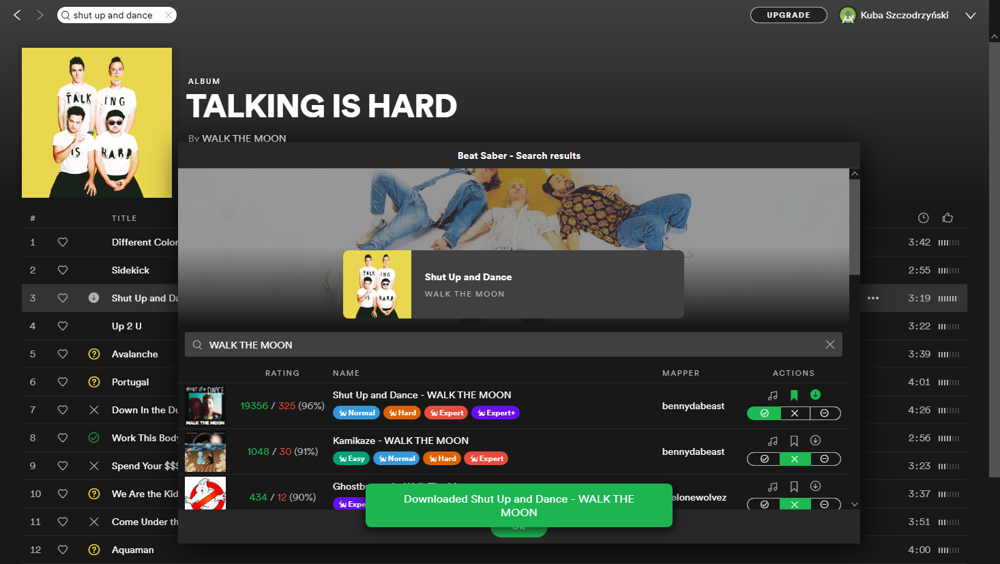

# spicetify-beat-saber

Beat Saber map availability plugin for Spicetify

## Description

This is a custom app for the Spotify desktop client (with Spicetify installed). It provides a helpful utility for modded Beat Saber players to show BeatSaver custom map availability next to Spotify tracks.

### Features

- searching tracks on BeatSaver
- map details (difficulty levels, notes per second, author, rating)
- audio preview
- bookmarking maps on BeastSaber [*]
- downloading maps directly to the Beat Saber directory [*]
- custom search query

[*] requires [spicetify-beat-saber-backend](https://github.com/kuba2k2/spicetify-beat-saber-backend) installed

### Backend usage

[spicetify-beat-saber-backend](https://github.com/kuba2k2/spicetify-beat-saber-backend) is required to bookmark maps on BeastSaber (due to CORS issues) and to download maps to Beat Saber directory. After installing, the backend can be configured in the popup menu in bottom-right corner of the Spotify client.

## Installation

**NOTE:** [install spicetify-beat-saber-backend](https://github.com/kuba2k2/spicetify-beat-saber-backend) first.

After installing the extension, you only need to set the Beat Saber game path to use the downloading feature. Refer to `Configuration` below.

### Modern clients (v1.2.x+)

**Make sure you're using Spicetify v2.20.0 or newer**

1. Install [Spicetify](https://spicetify.app/) if you haven't already.
2. Download `beatsaber-dist-x.x.x.zip` file from the Releases page of this repo (note: **NOT** the .spa file!).
3. Run `spicetify config-dir` to open your Spicetify directory.
4. Go to `CustomApps`. Unpack the downloaded `.zip` file there (along with the `beatsaber` directory itself).
5. `spicetify config custom_apps beatsaber`
6. `spicetify backup` (if you haven't done this before)
7. `spicetify apply`
8. The app should now be available in your Spotify client.

### Legacy clients (v1.1.56)

*This part is left for reference only. You probably want to use the modern version above.*

A custom [fork of Spicetify](https://github.com/kuba2k2/spicetify-legacy) is needed.

1. Install [spicetify-legacy](https://github.com/kuba2k2/spicetify-legacy) following the instructions in the README.
2. Download the `beatsaber-x.x.x.spa` file and `beatsaber.shim.js` from the Releases page of this repo.
3. Rename the downloaded `.spa` file to `beatsaber.spa`.
4. Copy `beatsaber.shim.js` to `~/.spicetify/Extensions` and `beatsaber.spa` file to `~/.spicetify/CustomApps` (the `~` means your home folder - c:\Users\username on Windows).
5. `spicetify config extensions beatsaber.shim.js`
6. `spicetify config custom_apps beatsaber.spa`
7. `spicetify backup` (if you haven't done this before)
8. `spicetify apply`
9. The app should now be available in your Spotify client.

## Configuration

A few configuration options are available in the Beat Saber popup window (bottom-right of the Spotify window):
- BeastSaber login data - required to use the bookmarking feature
  - `Username` is your BeastSaber public profile name (as in https://bsaber.com/members/profile-name-goes-here/)
  - `Login` is your e-mail address or login name that allows to login to BeastSaber
  - `Password` is pretty self-explanatory
- backend access info - required to use either bookmarking or downloading
  - `Hostname` - leave the default, which is `localhost:23287`
  - `Beat Saber directory` is the path to the Beat Saber game directory (i.e. the one with `Beat Saber.exe` in it, NOT `CustomLevels`)

## License

MIT
